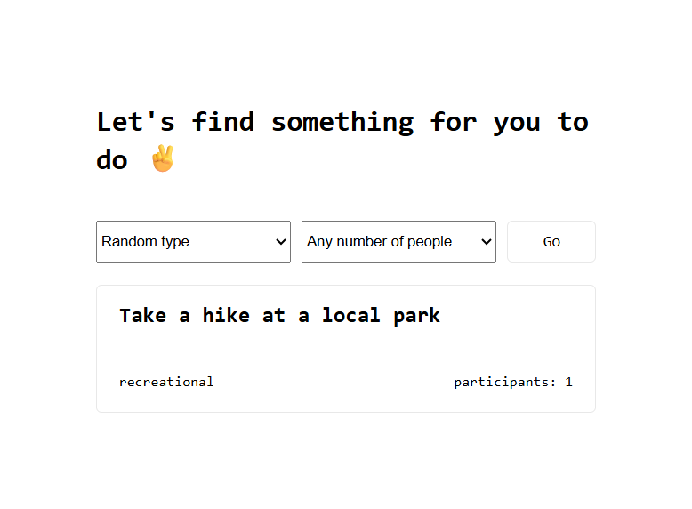

# 🎯 Bored Activity Generator

A simple web application that suggests activities based on:
- Type (education, charity, relaxation, etc.)
- Number of participants

## 🚀 Live Demo
https://bored.aragulkumar.com

## 📸 Preview

  

## 🛠 Tech Stack
- Node.js
- Express.js
- EJS
- Axios
- Bored API

## 📌 Features
- Random activity suggestions
- Filter by type & participants
- Clean UI
- Error handling

⭐ If you get bored often and find this project useful, don’t forget to star the repository.

